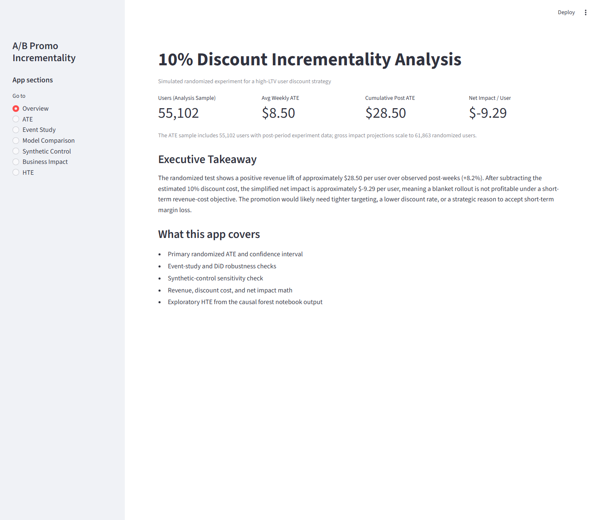
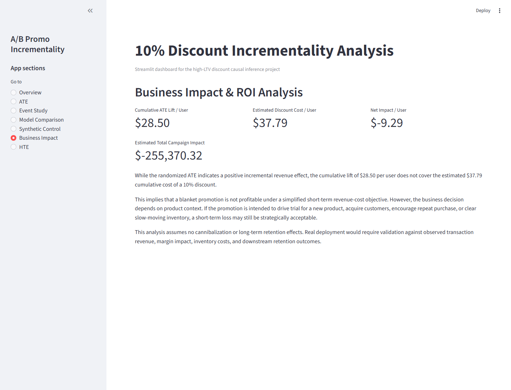

# A/B Promotion Incrementality Analysis

End-to-end causal inference project estimating whether a 10% discount to high-LTV users drives incremental revenue — and whether it's worth rolling out.

> **Data note:** Revenue is simulated. An 8% uplift is applied to treated high-LTV users in the post-period, so results should be read as a portfolio experiment simulation rather than observed discount-redemption evidence.

---

## Key Findings

- **+8.2% simulated revenue lift** — post-period diff-in-means ATE of **+$28.50 per user** over observed post-weeks (95% CI: [$23.90, $33.11])
- **DiD panel estimates are roughly +$8.41 to +$8.74 per user-week** across Naive DiD, User FE, TWFE, and Weighted DiD specifications, consistent with the simulated uplift and the randomized ATE
- **Blanket discount is not attractive** under a simplified revenue-cost objective: the $28.50 cumulative lift does not cover the ~$37.79 estimated discount cost per user (net ≈ −$9.29/user)
- **Causal forest / HTE** suggests exploratory variation in predicted lift (mean ≈ $8.40, SD ≈ $5.57) — not a validated targeting rule

## Business Recommendation

- **Do not broadly roll out** the 10% blanket discount under a short-term revenue-cost objective
- **Test lower discount levels or a validated targeting strategy** — higher-spend users show larger absolute lift, but a follow-up experiment is needed before deploying model-based targeting
- **Track margin, retention, and downstream behavior** — this analysis uses simplified revenue-cost assumptions with no cannibalization, margin, or retention effects

---

## Screenshots

**Overview** — key metrics at a glance



**Business Impact** — cumulative lift vs. discount cost



---

## Tech Stack

| Layer | Tools |
|---|---|
| Data pipeline | PostgreSQL, SQL marts (staging → core → marts) |
| Analysis | Python, pandas, statsmodels, scikit-learn, EconML (causal forests) |
| Dashboard | Streamlit |

---

## Data Flow

```
data/raw/ (Instacart public dataset)
  → PostgreSQL  (staging → core → marts)
  → analysis/02_inference.ipynb  (reads DB, exports processed CSVs)
  → app/streamlit_app.py  (reads processed CSVs, computes synthetic control live)
```

---

## How to Run

**1. Set up environment variables**

Create a `.env` file at the project root:

```
DB_NAME=...
DB_USER=...
DB_PASSWORD=...
DB_HOST=...
DB_PORT=...
```

**2. Run the notebook**

Open and run `analysis/02_inference.ipynb` end-to-end. This exports:
- `data/processed/panel_df.csv` — user-week panel (~440k rows)
- `data/processed/event_study.csv` — TWFE event-study coefficients

**3. Launch the Streamlit app**

```powershell
.venv\Scripts\Activate.ps1
streamlit run app/streamlit_app.py
```

**Live app:** https://targeted-promotion-incrementality-experiment-ltfx4qbfgnsn5ey2x.streamlit.app

---

## Notebook

[`analysis/02_inference.ipynb`](analysis/02_inference.ipynb)

Covers:
- Post-period ATE (primary estimate, randomized diff-in-means)
- Event study (TWFE, parallel-trends diagnostics)
- DiD, User FE, TWFE, Weighted DiD (robustness)
- Synthetic control (cohort-level robustness)
- Causal forest HTE (EconML, exploratory)
- Business impact / ROI breakdown
