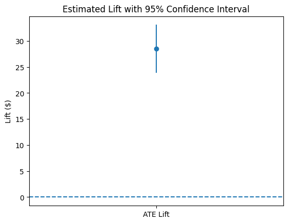
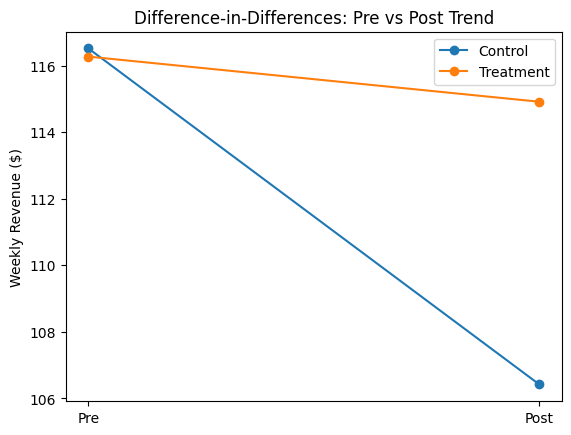
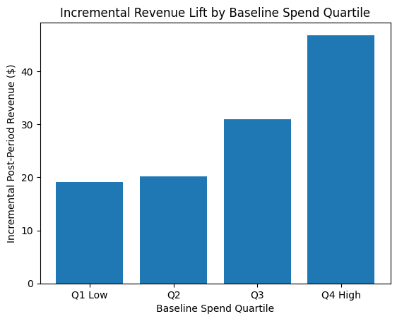

# Targeted Promotion Incrementality Experiment: Estimating Revenue Lift from a 10% Discount

## Overview

This project estimates the incremental revenue impact of a **10% targeted discount** offered to high-LTV users using a user-level randomized A/B experiment.

The analysis is implemented using a reproducible SQL pipeline (**staging → core → marts**) and validated with multiple causal inference methods, including post-period ATE estimation, clustered Difference-in-Differences (DiD), and fixed-effects panel regression.

The goal is to quantify the **causal lift in post-period revenue** and evaluate whether targeted promotions generate meaningful incremental value among high-LTV customers.

---

## Key Findings

| Metric | Result |
|------|------|
| Average Treatment Effect (ATE) | **+$28.50 revenue per user** |
| Percent Lift | **+8.16%** |
| 95% Confidence Interval | **[$23.90, $33.11]** |
| Clustered Difference-in-Differences | **+$8.74 weekly lift** |
| Fixed Effects DiD | **+$4.53 weekly lift** |

The targeted promotion generates statistically significant incremental revenue among high-LTV users across multiple causal estimators.

---

## Key Experiment Results

### Average Treatment Effect (ATE)

Estimated incremental revenue lift from the targeted promotion with 95% confidence interval.

---

### Difference-in-Differences Trend

Pre vs post comparison of treatment and control revenue trends used to validate the causal inference framework.

---

### Heterogeneous Treatment Effects

Incremental revenue lift segmented by baseline spend quartile, showing stronger absolute lift among higher-value users.

---

## Experimental Design

- **Dataset:** Instacart public dataset  
- **Eligibility:** Top 30% of users by pre-period (6-week) revenue  
- **Randomization:** User-level, 50/50 treatment vs control  
- **Post-period:** 6 weeks  
- **Primary KPI:** Post-period revenue per user  
- **Secondary KPIs:** Orders per user, AOV  

---

## Methodology

We estimate incremental lift using:

- **Post-period Average Treatment Effect (ATE)**
- **95% Confidence Intervals**
- **Clustered Difference-in-Differences (DiD)**
  - Standard errors clustered at the user level
- **Fixed Effects DiD (within-user demeaning)**
  - Controls for time-invariant user heterogeneity

---

## Key Results

- **Post-period ATE lift:** **+$28.50 per user (+8.16%)**
- **95% CI:** **[$23.90, $33.11]**
- **Clustered DiD (weekly lift):** **+$8.74**
- **Fixed Effects DiD (weekly lift):** **+$4.53**

Even under conservative fixed-effects estimates, the promotion generates statistically significant and economically meaningful incremental revenue.

The implied 6-week lift from the FE estimate (~$4.53 × 6 ≈ $27.18) aligns closely with the ATE estimate ($28.50), strengthening causal credibility.

---

## Heterogeneous Treatment Effects

To evaluate whether the promotion impact differs across customer segments, we estimate treatment lift by **baseline spend quartile** using pre-period revenue.

Users are segmented into four groups based on their pre-period revenue distribution:

- **Q1:** Lowest baseline spend
- **Q2:** Lower-middle baseline spend
- **Q3:** Upper-middle baseline spend
- **Q4:** Highest baseline spend

Treatment lift is computed within each quartile as the difference between treatment and control mean post-period revenue.

**Results:**

| Baseline Quartile | Control Mean | Treatment Mean | Lift ($) | Lift (%) |
|------------------|-------------|---------------|---------|---------|
| Q1 (Low) | 224.66 | 243.74 | +19.08 | +8.49% |
| Q2 | 269.44 | 289.65 | +20.21 | +7.50% |
| Q3 | 340.26 | 371.22 | +30.96 | +9.10% |
| Q4 (High) | 561.64 | 608.48 | +46.84 | +8.34% |

Treatment lift increases with baseline spend, with the largest absolute revenue gains observed among the highest-spending users.

This suggests that **targeted promotions generate the strongest incremental revenue impact among high-value customers**, reinforcing the effectiveness of LTV-based targeting strategies.

---

## Business Implications

- The targeted discount drives meaningful incremental revenue among high-LTV users.
- Results remain robust after controlling for time trends and user-level heterogeneity.
- Scaled to 100,000 high-LTV users, the conservative FE estimate implies **~$2.7M incremental revenue over six weeks**.

---

## Experiment Interpretation

Overall results indicate that the targeted 10% promotion generates statistically significant incremental revenue among high-LTV users.

Across multiple estimation strategies (ATE, clustered DiD, and fixed-effects models), the estimated treatment effect remains positive and economically meaningful. The alignment between the simple ATE estimate and the more conservative fixed-effects DiD estimate strengthens confidence in the causal interpretation of the results.

Segment-level analysis further shows that higher-spending users generate the largest absolute revenue lift, suggesting that targeting promotions toward high-value customers is an effective strategy for maximizing incremental revenue.

From a product or marketing decision perspective, these findings support **scaling the targeted promotion strategy**, particularly for high-LTV customer segments.

---

## Repo Structure

- `sql/staging` — raw ingestion tables  
- `sql/core` — cleaned and standardized transformations  
- `sql/marts` — experiment-ready fact tables  
- `analysis` — statistical inference and visualization  
- `docs` — experiment specifications and documentation  

---

## Reproducibility

1. Load raw data into staging tables  
2. Run SQL transformations (`staging → core → marts`)  
3. Execute `analysis/incrementality.ipynb`  

All statistical estimates are reproducible from experiment-ready mart tables.

---

## Technical Stack

- SQL (PostgreSQL)  
- Python (pandas, statsmodels, numpy, matplotlib)  
- Cluster-robust inference  
- Panel data modeling  

Environment dependencies are listed in 'requirements.txt'.
